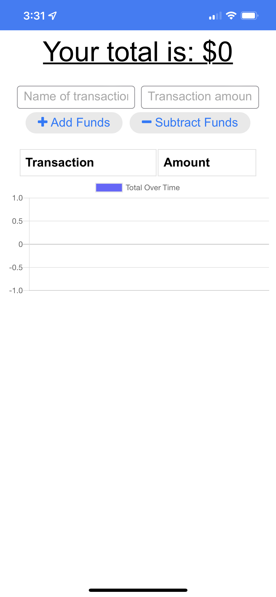

# Budget Tracker

## Description

The purpose of this project was to create a PWA for an existing budgeting application so that users could install it on their phones. The app can function completely offline and will update its online database if/when the mobile device is able to make an online data connection either through mobile data or WiFi.

## Usage

Desktop users should open the [Deployed Application](https://powerful-woodland-37736.herokuapp.com/) in Chrome then click the Install link in the browser URL.

Mobile users can browse to the application in FireFox, Safari, Android browser, or Chrome on their device and tap the Install icon. This icon varies in appearance between mobile browsers. For additional help, please check this helpful article [Install and Uninstalling Web Apps](https://developer.mozilla.org/en-US/docs/Web/Progressive_web_apps/Installing).

## Deployed Application
[Budget Tracker - PWA](https://powerful-woodland-37736.herokuapp.com/)

or on mobile browse to: [https://tinyurl.com/bpbudapp](https://tinyurl.com/bpbudapp)

## Screenshot 

  
  
  

